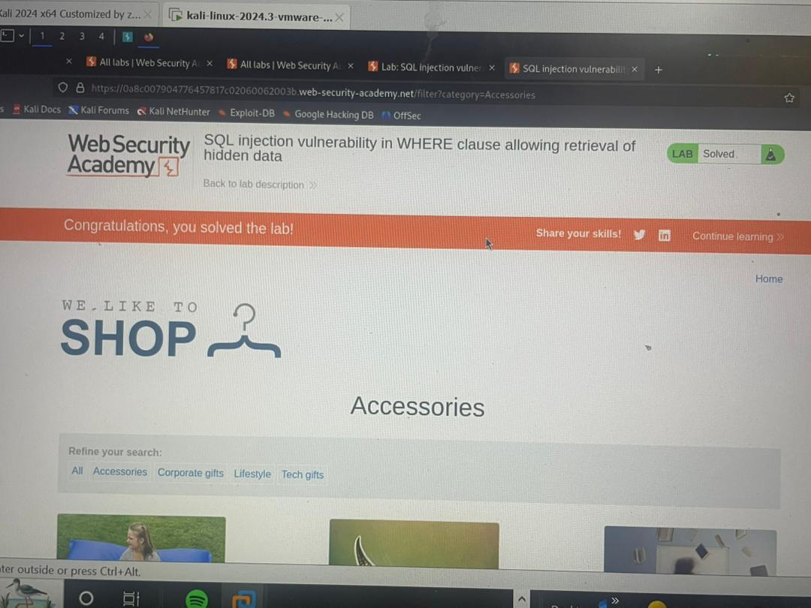

# Lab 01 — SQL injection vulnerability in WHERE clause allowing retrieval of hidden data (featured)

**Vulnerability:** SQL Injection — WHERE-clause influence (in-band)  
**Lab source:** PortSwigger Web Security Academy  

---

## Short overview
This lab demonstrates how user-supplied input can influence a query's WHERE clause, causing the application to return rows that would normally be excluded.

## Goal
Confirm that the product category filter parameter is incorporated into the database WHERE clause and that manipulating it can change which rows are returned — using non-destructive, controlled probes.

## Environment & tools
- Lab environment: PortSwigger Web Security Academy (controlled).  
- Tools: Browser and an HTTP proxy/intercept tool (e.g., Burp Suite) to capture and edit the request.

---

## Steps I performed (sanitized)
1. Opened the lab page and located the product list filtered by a **category** parameter (visible in the request URL or form body).  
2. Started the proxy interceptor and performed a normal category selection to capture the HTTP request carrying the category parameter.  
3. In the intercepted request, modified the category parameter so the backend condition would evaluate true for broader results  
   - **Note (sanitization):** I used a tautology-style probe (boolean-true pattern). 
4. Forwarded the modified request from the proxy to the server.  
5. Compared the application response to the baseline: the modified request returned additional rows — specifically one or more unreleased/hidden products that were not visible with the baseline request.

---

## What I observed (evidence)
- Baseline response: product list showed only released items (expected).  
- After the modified request: product list included additional/unreleased items (unexpected).  
- Reproduced the change multiple times to ensure the behavior was consistent and not transient.

---

## Proof 

---

## Variations tried
- Repeated the test with several different inputs to ensure reliability.  
- Performed non-destructive boolean-style checks to validate conditional behavior.

## Mitigation
- Use parameterized queries / prepared statements (avoid concatenating user input into SQL).  
- Validate and canonicalize inputs server-side (whitelist allowed category values).  
- Suppress detailed DB error messages and apply least-privilege to DB accounts.

## Lessons learned
- Small changes to filter parameters can reveal subtle query logic issues — inspect server-side handling of filters.  
- Emphasize observations and sanitized evidence in writeups; avoid posting raw exploit strings.  
- Reproduce probes to confirm reliability and reduce false positives.
